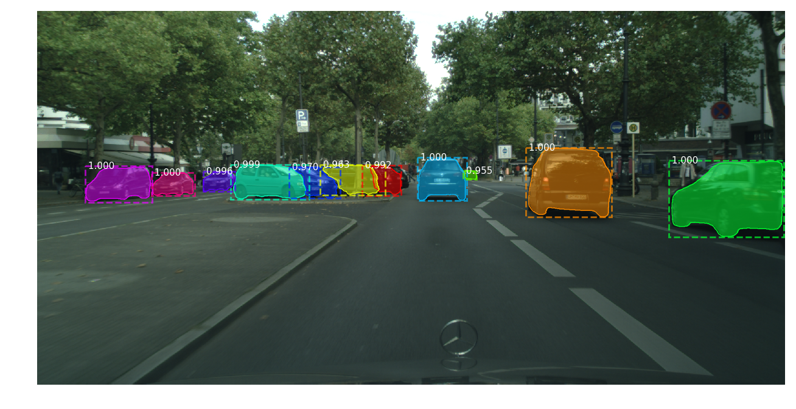

Mask R-CNN for Cityscapes Dateset
==================================

An implementation of [Mask R-CNN](https://arxiv.org/abs/1703.06870) on Cityscapes dataset.

Requirement
------------
Ubuntu 16.04, Python 3.5, TensorFlow 1.4, Keras 2.1.4

Training
------------
1.Download [Cityscapes data](https://www.cityscapes-dataset.com/) (gtFine_trainvaltest.zip, leftImg8bit_trainvaltest.zip) and extract them. <br>
We just need the json files, so extract them into 'Json_files/'. Run `scripts/process_dataset.py`.<br>
And the folder structure would then be (where folders under 'gtFine/' are empty):<br>
```
data/
|-- leftImg8bit/
|   |-- train/<br>
|   |-- val/<br>
|   |-- test/<br>
|-- gtFine/
|   |-- train/<br>
|   |-- val/<br>
|-- Json_files/
|   |-- train/<br>
|   |-- val/<br>
|   |-- test/
```
2.Rename the filenames, e.g. 'aachen_000000_000019_leftImg8bit.png' -->
'aachen_000000_000019.png'. See `scripts/process_filename.py`.

3.Draw ground truth masks for the instances.<br>
Use `cityscapesScripts/cityscapesscripts/helpers/label.py` to modify the trainIds as suitable for your model ([detailed description](https://github.com/mcordts/cityscapesScripts)).<br>
Then draw the ground truth images:
```
cityscapesScripts/cityscapesscripts/preparation/json2labelImg.py
```
Some folders may be empty because they do not contain the masks for any instance you want to train, and you should use `scripts/process_empty.py` to delete them.

4.Train your model and compute the AP:
```
Mask_RCNN/cityscapes.py
```

Test Single Image
------------------
You can test on a random or specific image by running:
```
Mask_RCNN/detect.py
```

Result (a random image in test set):

